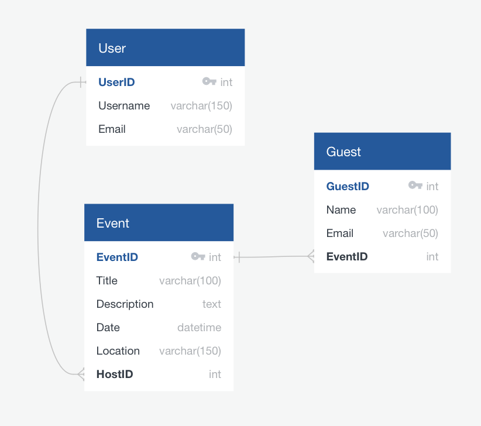

# Evently

## Overview
Evently is a web application designed to streamline the management of events and guest lists, drawing inspiration from Partiful. The application enables users to perform CRUD operations for events and guests, integrates with third-party APIs for enhanced functionality, and includes secure user authentication. Key features include event scheduling, location mapping, and notifications.

## Features
**Event Management:**
- Create, Read, Update, Delete (CRUD) operations for events.
- Events have a title, description, date, location, and associated host (user).

**Guest Management:**
- Guests can be added to events with their name and email address.

**Authentication:**
- Token-based authentication using Django REST Framework's Token Authentication.

**Third-Party APIs:**
- Google Maps API: Integrate event locations with Google Maps to display maps and provide directions.
- SendGrid API: Send email notifications to guests about event details, updates, or invitations.

**Additional Features:**
- Search events and filter results.
- Provide alerts for event updates and invitations.

#### Database Schema



## Setup Instructions

1. **Forking the Repository:**
   - Visit the project repository on GitHub and fork it to create a copy in your own GitHub account.

2. **Clone the Repository:**
   - Clone the repository to your local machine:
     ```bash
     git clone <repository-url>
     cd <repository-name>
     ```

3. **Backend (Django):**
   - **Navigate to the Backend Directory:**
     ```bash
     cd backend
     ```
   - **Start the Server:**
     ```bash
     docker-compose up --build
     ```

4. **Frontend (React):**
   - **Navigate to the Frontend Directory:**
     ```bash
     cd frontend
     ```
   - **Install Dependencies:**
     ```bash
     npm install
     ```
   - **Start the Development Server:**
     ```bash
     npm start
     ```

5. **Environment Variables:**
   - Ensure all necessary environment variables for Google Maps API key and SendGrid API key are set up.

6. **Access the Application:**
   - The backend server will typically be accessible at `http://localhost:8000`.
   - The frontend application will typically be accessible at `http://localhost:3000`.

## Project Status

**Completed:**
- **Backend Development**: Implemented Django REST API for event and guest models using PostgreSQL and Docker.
- **Authentication**: Implemented token-based authentication with Django REST Framework.

**In Progress:**
- **Frontend Development**: Developing the React application for the user interface.

**Remaining:**
- **Integration of Google Maps API**: Incorporate for event location mapping and displaying on UI.
- **Integration of SendGrid API**: Implement email notifications for event details and updates.
- **Deployment**: Deploy the application on AWS.
